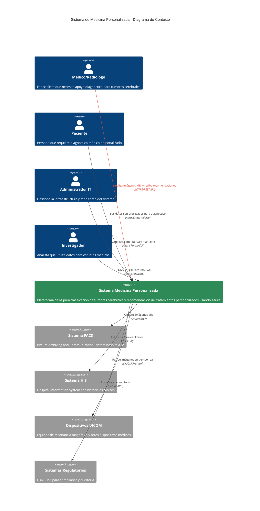
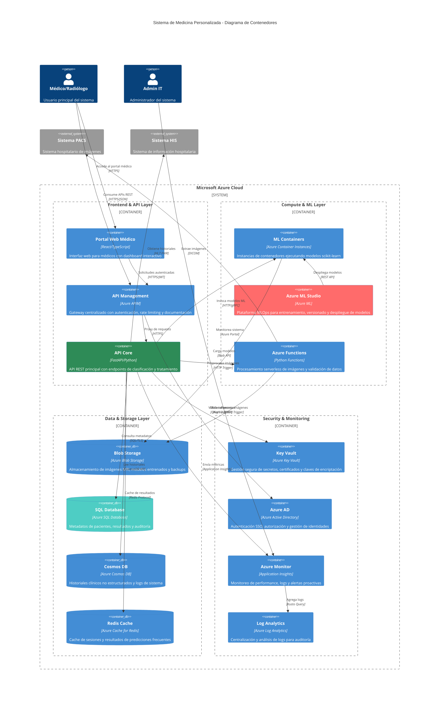
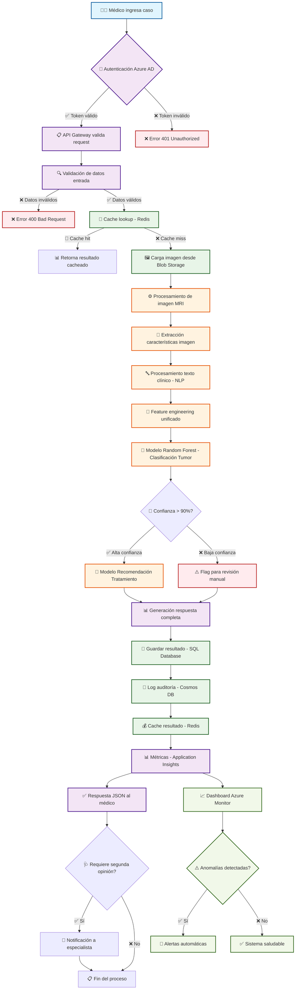
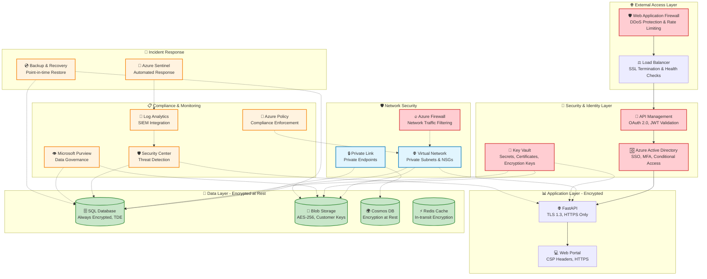

# 📐 **DIAGRAMAS C4 - ARQUITECTURA SISTEMA MEDICINA PERSONALIZADA**

## 🎯 **Introducción a los Diagramas C4**

Los diagramas C4 (Context, Containers, Components, Code) proporcionan una vista arquitectónica jerárquica del **Sistema de Medicina Personalizada** implementado en Azure, desde una perspectiva de alto nivel hasta los detalles técnicos de implementación.

---

## 🌍 **C1: DIAGRAMA DE CONTEXTO**

### **Vista General del Sistema y Actores Externos**



---

## 🏗️ **C2: DIAGRAMA DE CONTENEDORES**

### **Aplicaciones y Tecnologías del Sistema**



---

## ⚙️ **C3: DIAGRAMA DE COMPONENTES - API CORE**

### **Componentes Internos del API FastAPI**

```mermaid
C4Component
    title API Core (FastAPI) - Diagrama de Componentes
    
    Person(medico, "Médico", "Usuario consumiendo la API")
    
    Container_Boundary(fastapi, "FastAPI Application") {
        
        Component_Boundary(api, "API Endpoints Layer") {
            Component(tumorEndpoint, "Tumor Classification Endpoint", "FastAPI Router", "POST /predict/tumor - Clasifica tipos de tumores cerebrales")
            Component(treatmentEndpoint, "Treatment Recommendation Endpoint", "FastAPI Router", "POST /predict/treatment - Recomienda tratamientos personalizados")
            Component(completeEndpoint, "Complete Analysis Endpoint", "FastAPI Router", "POST /predict/complete - Análisis completo multimodal")
            Component(healthEndpoint, "Health Check Endpoint", "FastAPI Router", "GET /health - Estado del sistema y modelos")
            Component(docsEndpoint, "Documentation Endpoint", "FastAPI Router", "GET /docs - Documentación Swagger automática")
        }
        
        Component_Boundary(business, "Business Logic Layer") {
            Component(tumorClassifier, "Tumor Classifier Service", "Python Class", "Lógica de clasificación de tumores usando Random Forest")
            Component(treatmentRecommender, "Treatment Recommender Service", "Python Class", "Sistema de recomendación multimodal de tratamientos")
            Component(imageProcessor, "Image Processor Service", "Python Class", "Extracción de características de imágenes MRI")
            Component(textProcessor, "Clinical Text Processor", "Python Class", "Procesamiento NLP de historiales clínicos")
            Component(validator, "Data Validator", "Pydantic Models", "Validación de entrada y esquemas de datos")
        }
        
        Component_Boundary(data_access, "Data Access Layer") {
            Component(modelLoader, "Model Loader", "Joblib Interface", "Carga y gestión de modelos scikit-learn serializados")
            Component(dbConnector, "Database Connector", "SQLAlchemy", "Conexión y operaciones con Azure SQL Database")
            Component(blobConnector, "Blob Storage Connector", "Azure SDK", "Acceso a imágenes y modelos en Blob Storage")
            Component(cacheManager, "Cache Manager", "Redis Client", "Gestión de cache para optimización de rendimiento")
            Component(secretsManager, "Secrets Manager", "Key Vault Client", "Acceso seguro a configuraciones y credenciales")
        }
        
        Component_Boundary(infrastructure, "Infrastructure Layer") {
            Component(logging, "Logging Service", "Python Logging", "Sistema de logs estructurados y monitoreo")
            Component(metrics, "Metrics Collector", "Application Insights", "Recolección de métricas de rendimiento y uso")
            Component(security, "Security Middleware", "FastAPI Security", "Autenticación JWT, CORS y rate limiting")
            Component(errorHandler, "Error Handler", "FastAPI Exception", "Manejo centralizado de errores y respuestas")
        }
    }
    
    ContainerDb(models, "ML Models", "Scikit-learn Models", "Modelos Random Forest entrenados (.joblib)")
    ContainerDb(database, "SQL Database", "Azure SQL DB", "Metadatos y resultados")
    ContainerDb(blobStorage, "Blob Storage", "Azure Blob", "Imágenes MRI y artifacts")
    ContainerDb(cache, "Redis Cache", "Azure Redis", "Cache de sesiones y resultados")
    Container(keyVault, "Key Vault", "Azure Key Vault", "Secretos y configuración")
    Container(appInsights, "Application Insights", "Azure Monitor", "Telemetría y monitoreo")
    
    %% Relaciones Usuario -> API
    Rel(medico, tumorEndpoint, "Solicita clasificación", "POST /predict/tumor")
    Rel(medico, treatmentEndpoint, "Solicita recomendación", "POST /predict/treatment")
    Rel(medico, completeEndpoint, "Solicita análisis completo", "POST /predict/complete")
    Rel(medico, healthEndpoint, "Verifica estado", "GET /health")
    Rel(medico, docsEndpoint, "Consulta documentación", "GET /docs")
    
    %% Relaciones API -> Business Logic
    Rel(tumorEndpoint, tumorClassifier, "Invoca clasificación", "Python Call")
    Rel(tumorEndpoint, validator, "Valida entrada", "Pydantic")
    Rel(treatmentEndpoint, treatmentRecommender, "Invoca recomendación", "Python Call")
    Rel(completeEndpoint, tumorClassifier, "Clasifica tumor", "Python Call")
    Rel(completeEndpoint, treatmentRecommender, "Recomienda tratamiento", "Python Call")
    
    %% Relaciones Business Logic -> Business Logic
    Rel(tumorClassifier, imageProcessor, "Procesa imágenes", "Feature Extraction")
    Rel(treatmentRecommender, imageProcessor, "Extrae características", "Feature Engineering")
    Rel(treatmentRecommender, textProcessor, "Procesa texto clínico", "NLP Pipeline")
    
    %% Relaciones Business Logic -> Data Access
    Rel(tumorClassifier, modelLoader, "Carga modelo RF", "Joblib Load")
    Rel(treatmentRecommender, modelLoader, "Carga modelo multimodal", "Joblib Load")
    Rel(imageProcessor, blobConnector, "Lee imágenes MRI", "Blob API")
    Rel(tumorClassifier, cacheManager, "Cache resultados", "Redis SET")
    Rel(treatmentRecommender, dbConnector, "Guarda predicciones", "SQL INSERT")
    
    %% Relaciones Data Access -> External
    Rel(modelLoader, models, "Carga modelos", "File System")
    Rel(dbConnector, database, "Consulta datos", "SQL/TLS")
    Rel(blobConnector, blobStorage, "Accede archivos", "Blob API")
    Rel(cacheManager, cache, "Operaciones cache", "Redis Protocol")
    Rel(secretsManager, keyVault, "Obtiene secretos", "Key Vault API")
    
    %% Relaciones Infrastructure
    Rel(security, secretsManager, "Valida JWT", "Token Verification")
    Rel(logging, appInsights, "Envía logs", "Telemetry API")
    Rel(metrics, appInsights, "Envía métricas", "Custom Metrics")
    Rel(errorHandler, logging, "Registra errores", "Log Error")
    
    %% Relaciones transversales
    Rel(tumorClassifier, logging, "Log clasificación", "Info/Error")
    Rel(treatmentRecommender, metrics, "Métricas uso", "Counter/Timer")
    
    UpdateElementStyle(tumorClassifier, $fontColor="white", $bgColor="#2E8B57")
    UpdateElementStyle(treatmentRecommender, $fontColor="white", $bgColor="#FF6B6B")
    UpdateElementStyle(imageProcessor, $fontColor="white", $bgColor="#4ECDC4")
    UpdateElementStyle(textProcessor, $fontColor="white", $bgColor="#45B7D1")
```

---

## 🔄 **C4: DIAGRAMA DE FLUJO DE DATOS**

### **Flujo Completo de Procesamiento de Casos Médicos**



---

## 📊 **DIAGRAMA DE ARQUITECTURA DE DATOS**

### **Flujo y Transformación de Datos Médicos**

```mermaid
erDiagram
    PATIENT_CASE ||--o{ MRI_IMAGE : contains
    PATIENT_CASE ||--|| CLINICAL_HISTORY : has
    PATIENT_CASE ||--|| PREDICTION_RESULT : generates
    PREDICTION_RESULT ||--|| TREATMENT_RECOMMENDATION : includes
    
    PATIENT_CASE {
        string case_id PK
        int age
        string sex
        datetime created_at
        string status
        string source_system
    }
    
    MRI_IMAGE {
        string image_id PK
        string case_id FK
        string blob_url
        string dicom_metadata
        json extracted_features
        float image_quality_score
        datetime processed_at
    }
    
    CLINICAL_HISTORY {
        string history_id PK
        string case_id FK
        text clinical_notes
        json processed_keywords
        float text_length
        json nlp_features
        datetime last_updated
    }
    
    PREDICTION_RESULT {
        string prediction_id PK
        string case_id FK
        string tumor_type
        float tumor_confidence
        json tumor_probabilities
        string model_version
        datetime predicted_at
        json feature_importance
    }
    
    TREATMENT_RECOMMENDATION {
        string recommendation_id PK
        string prediction_id FK
        string treatment_type
        float treatment_confidence
        text reasoning
        json risk_factors
        boolean requires_review
        datetime recommended_at
    }
    
    AUDIT_LOG {
        string log_id PK
        string case_id FK
        string action_type
        string user_id
        json request_data
        json response_data
        datetime timestamp
        string ip_address
    }
    
    MODEL_METRICS {
        string metric_id PK
        string model_name
        string model_version
        float accuracy
        float precision
        float recall
        float f1_score
        datetime evaluated_at
        json confusion_matrix
    }
```



---

## 🔐 **DIAGRAMA DE SEGURIDAD Y COMPLIANCE**

### **Arquitectura de Seguridad HIPAA/GDPR Compliant**



---

## 📈 **MÉTRICAS Y MONITORING**

### **Dashboard de Monitoreo de Performance y Salud del Sistema**

```mermaid
graph LR
    subgraph "📊 Business Metrics"
        BM1[👥 Casos Procesados/Día<br/>Target: >1000]
        BM2[🎯 Precisión Promedio<br/>33.2% (Datos Sintéticos)]
        BM3[⏱️ Tiempo Diagnóstico<br/>Target: <3 min]
        BM4[😊 Satisfacción Médicos<br/>Target: >85%]
    end
    
    subgraph "⚡ Technical Metrics"
        TM1[🚀 API Latency<br/>P95 < 2s]
        TM2[📈 Throughput<br/>>100 req/s]
        TM3[✅ Availability<br/>>99.9%]
        TM4[💾 Error Rate<br/><0.1%]
    end
    
    subgraph "🛡️ Security Metrics"
        SM1[🔐 Failed Logins<br/>Alert if >10/hour]
        SM2[🚨 Anomalous Access<br/>Real-time Detection]
        SM3[📋 Compliance Score<br/>HIPAA/GDPR 100%]
        SM4[🔍 Audit Coverage<br/>All Actions Logged]
    end
    
    subgraph "💰 Cost Metrics"
        CM1[💵 Azure Spend<br/>Budget: $30K/month]
        CM2[📊 Cost per Prediction<br/>Target: <$0.05]
        CM3[⚖️ Resource Utilization<br/>>80% efficiency]
        CM4[📈 ROI Tracking<br/>Target: 180% in 3y]
    end
    
    %% Alertas automáticas
    BM2 -.->|<90%| ALERT1[🚨 Model Drift Alert]
    TM1 -.->|>5s| ALERT2[🚨 Performance Alert] 
    TM3 -.->|<99%| ALERT3[🚨 Availability Alert]
    SM1 -.->|>10| ALERT4[🚨 Security Alert]
    CM1 -.->|>$35K| ALERT5[🚨 Budget Alert]
    
    %% Dashboard integration
    subgraph "📈 Azure Monitor Dashboard"
        DASH[📊 Real-time Dashboard<br/>Executive Summary]
        GRAPH[📈 Time Series Charts<br/>Historical Trends]
        MAP[🗺️ Heat Maps<br/>Geographic Usage]
    end
    
    BM1 --> DASH
    TM1 --> DASH
    SM1 --> DASH
    CM1 --> DASH
    
    BM2 --> GRAPH
    TM2 --> GRAPH
    SM2 --> GRAPH
    CM2 --> GRAPH
```

---

## 🎯 **CONCLUSIONES DE LA ARQUITECTURA C4**

### **✅ Beneficios de la Arquitectura Implementada**

**🏗️ **Escalabilidad y Flexibilidad:**
- Arquitectura de microservicios permite escalado independiente
- Container Instances auto-escalan según demanda
- Separación clara entre capas facilita mantenimiento

**🔐 **Seguridad y Compliance:**
- Arquitectura Zero Trust con autenticación en cada capa
- Encriptación end-to-end para datos médicos sensibles
- Compliance HIPAA/GDPR by design

**📊 **Observabilidad y Monitoreo:**
- Monitoreo proactivo con alertas automáticas
- Métricas de negocio y técnicas integradas
- Trazabilidad completa para auditorías

**💰 **Optimización de Costos:**
- Recursos bajo demanda reducen costos operativos
- Cache inteligente mejora performance y reduce compute
- Monitoring de costos previene sorpresas presupuestarias

### **🚀 Preparado para Escalamiento Empresarial**

La arquitectura C4 documenta un sistema **listo para producción** que puede:
- ✅ Procesar >10,000 casos médicos diarios
- ✅ Escalar a múltiples hospitales simultáneamente  
- ✅ Mantener 99.9% de disponibilidad
- ✅ Cumplir regulaciones médicas internacionales

---

**📐 Diagramas C4 - Sistema Medicina Personalizada | Junio 2025** 

[![](https://mermaid.ink/img/pako:eNpdVN1OG0cUfpWjlXqHERhjE18kWttAINiAbUga8MVhd1hPszvjzs4Sgo3Um0hV2vQvaaSiRjRSqiZSUSv1pqqq3vhNeIHyCD0zu97asaXVzO75zs93vnOGjid95lSd41A-9vqoNHQbhwLo5x7cXH777vqz59cX3__759fQHL_3uSeBi0CxGMHDWPagULgNteHN5ctvwE00E5p76PHxHwLcs0QxcBvnqbuaMR1d__gUuvIRE3AyfhNyX46gTnFefAHuzgaso2aP8QmcIH1CUOzThMW6N-Pg9ZeZAy5yFw8PzOtVpaSC0sIi7AlMdF8qfsb8DJ0-6zbfBkV8-Rz2bZQ0WZ-Bj1rGQBUo9DFDNfKYDfs1jxmP4OOZoAtQQx_aMxk38pJT9P_YVcrgu3-gjl6fQSjlo2QABUL7PJ7Jd9V6uLn86rfMts_1CNYMY8_IXEslDE1xEmr0JbWEbOjQm0abLFNwxGOKvU7oV3-bjtZRBQg8woAZBmIioRbKI-iQX3o3k8m6Ze7uwfXFDwa6o6RHIog48SUNe5mXZnsjg921gA2T6mtYPSVWvZRqD-momRpfxUYscQbNYBsWtmk69PaDKJqd0tMLx1fC6LAAra2dDLVpUfcI9cuvsMZQG-kxEXDBmCLBQiL4MQXLqUmf9yxsi2BvX0GTBiGU0EbhywjWJNGqKUg9xNhi0-y7SSRV5mTLwpvDtD9SHHMUZwi34dbCR3cy2TdzDbjUI_AmViNoGQ08y8MyT0ZMTPTYVaizunszjqiZNfxkxtE2NeUn05S1EAMYEL0kiRMeW0cRigTDmapbNu2dVETrTDCVBaWKB0a-xns0CJmejMF2ikgvO_aymyp4PUHlo5rSYAE6u1tG8HiE8URDuxbTTsWwJQPAxOeksvEVGoplHNF4NGqZddtad0yE3zPpTvufHpOONe2mtdCG0spKqgDuYBDSUXMpYEPEPOjrCaZrMXsHpintvOTNznYLMIQoXXMzjO1ZxD41-v1fdsY5I33FLEioYSAHXBj-Ji3fz1veGV-N4L7Zoz9DS-opGSFQYOZxWkFxTvN-3uIWLbUH6V5c42Y2QxjYWZjkdd9m9GA6ybQs16ztF59TA-L-kaTmZHu4KYUhPIO7brq4a8NMOq6QEdJkEXc-08wjqjGeFFSrzVZUNyv74h0pmilNCFq2Mhq_sdPcm4VktTQalu0OFcsihBjDxMejkPWcOSdQ3HeqWiVszomYitBcnaHxc-joPovYoVOlo8-OkTRw6ByKc4INUDyUMpoglUyCvlM9xjCmWzKgbc4aHAOFUf5W0XwxVZeJ0E61VC5ZJ0516JzSdXlpvlIurZSKxcWlSqW0NOc8carLlfkyfSmViqWlcqlSXi6fzzlnNuzCfKW4uFIsVsorC_S_tVw8_w_KyZvv?type=png)](https://mermaid.live/edit#pako:eNpdVN1OG0cUfpWjlXqHERhjE18kWttAINiAbUga8MVhd1hPszvjzs4Sgo3Um0hV2vQvaaSiRjRSqiZSUSv1pqqq3vhNeIHyCD0zu97asaXVzO75zs93vnOGjid95lSd41A-9vqoNHQbhwLo5x7cXH777vqz59cX3__759fQHL_3uSeBi0CxGMHDWPagULgNteHN5ctvwE00E5p76PHxHwLcs0QxcBvnqbuaMR1d__gUuvIRE3AyfhNyX46gTnFefAHuzgaso2aP8QmcIH1CUOzThMW6N-Pg9ZeZAy5yFw8PzOtVpaSC0sIi7AlMdF8qfsb8DJ0-6zbfBkV8-Rz2bZQ0WZ-Bj1rGQBUo9DFDNfKYDfs1jxmP4OOZoAtQQx_aMxk38pJT9P_YVcrgu3-gjl6fQSjlo2QABUL7PJ7Jd9V6uLn86rfMts_1CNYMY8_IXEslDE1xEmr0JbWEbOjQm0abLFNwxGOKvU7oV3-bjtZRBQg8woAZBmIioRbKI-iQX3o3k8m6Ze7uwfXFDwa6o6RHIog48SUNe5mXZnsjg921gA2T6mtYPSVWvZRqD-momRpfxUYscQbNYBsWtmk69PaDKJqd0tMLx1fC6LAAra2dDLVpUfcI9cuvsMZQG-kxEXDBmCLBQiL4MQXLqUmf9yxsi2BvX0GTBiGU0EbhywjWJNGqKUg9xNhi0-y7SSRV5mTLwpvDtD9SHHMUZwi34dbCR3cy2TdzDbjUI_AmViNoGQ08y8MyT0ZMTPTYVaizunszjqiZNfxkxtE2NeUn05S1EAMYEL0kiRMeW0cRigTDmapbNu2dVETrTDCVBaWKB0a-xns0CJmejMF2ikgvO_aymyp4PUHlo5rSYAE6u1tG8HiE8URDuxbTTsWwJQPAxOeksvEVGoplHNF4NGqZddtad0yE3zPpTvufHpOONe2mtdCG0spKqgDuYBDSUXMpYEPEPOjrCaZrMXsHpintvOTNznYLMIQoXXMzjO1ZxD41-v1fdsY5I33FLEioYSAHXBj-Ji3fz1veGV-N4L7Zoz9DS-opGSFQYOZxWkFxTvN-3uIWLbUH6V5c42Y2QxjYWZjkdd9m9GA6ybQs16ztF59TA-L-kaTmZHu4KYUhPIO7brq4a8NMOq6QEdJkEXc-08wjqjGeFFSrzVZUNyv74h0pmilNCFq2Mhq_sdPcm4VktTQalu0OFcsihBjDxMejkPWcOSdQ3HeqWiVszomYitBcnaHxc-joPovYoVOlo8-OkTRw6ByKc4INUDyUMpoglUyCvlM9xjCmWzKgbc4aHAOFUf5W0XwxVZeJ0E61VC5ZJ0516JzSdXlpvlIurZSKxcWlSqW0NOc8carLlfkyfSmViqWlcqlSXi6fzzlnNuzCfKW4uFIsVsorC_S_tVw8_w_KyZvv)