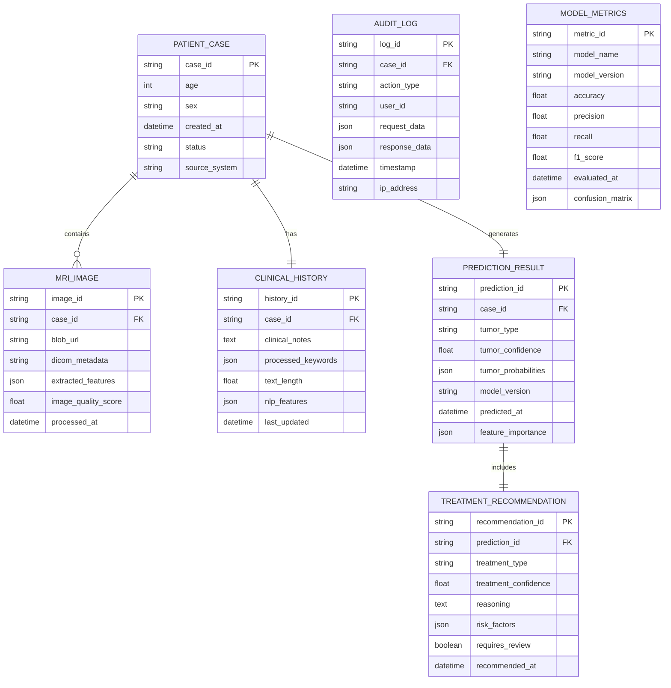

# 📐 **DIAGRAMAS C4 - ARQUITECTURA SISTEMA MEDICINA PERSONALIZADA**

## 🎯 **Introducción a los Diagramas C4**

Los diagramas C4 (Context, Containers, Components, Code) proporcionan una vista arquitectónica jerárquica del **Sistema de Medicina Personalizada** implementado en Azure, desde una perspectiva de alto nivel hasta los detalles técnicos de implementación.

---

## 🌍 **C1: DIAGRAMA DE CONTEXTO**

### **Vista General del Sistema y Actores Externos**


---

## 🏗️ **C2: DIAGRAMA DE CONTENEDORES**

### **Aplicaciones y Tecnologías del Sistema**


---

## ⚙️ **C3: DIAGRAMA DE COMPONENTES - API CORE**

### **Componentes Internos del API FastAPI**

```mermaid
C4Component
    title API Core (FastAPI) - Diagrama de Componentes
    
    Person(medico, "Médico", "Usuario consumiendo la API")
    
    Container_Boundary(fastapi, "FastAPI Application") {
        
        Component_Boundary(api, "API Endpoints Layer") {
            Component(tumorEndpoint, "Tumor Classification Endpoint", "FastAPI Router", "POST /predict/tumor - Clasifica tipos de tumores cerebrales")
            Component(treatmentEndpoint, "Treatment Recommendation Endpoint", "FastAPI Router", "POST /predict/treatment - Recomienda tratamientos personalizados")
            Component(completeEndpoint, "Complete Analysis Endpoint", "FastAPI Router", "POST /predict/complete - Análisis completo multimodal")
            Component(healthEndpoint, "Health Check Endpoint", "FastAPI Router", "GET /health - Estado del sistema y modelos")
            Component(docsEndpoint, "Documentation Endpoint", "FastAPI Router", "GET /docs - Documentación Swagger automática")
        }
        
        Component_Boundary(business, "Business Logic Layer") {
            Component(tumorClassifier, "Tumor Classifier Service", "Python Class", "Lógica de clasificación de tumores usando Random Forest")
            Component(treatmentRecommender, "Treatment Recommender Service", "Python Class", "Sistema de recomendación multimodal de tratamientos")
            Component(imageProcessor, "Image Processor Service", "Python Class", "Extracción de características de imágenes MRI")
            Component(textProcessor, "Clinical Text Processor", "Python Class", "Procesamiento NLP de historiales clínicos")
            Component(validator, "Data Validator", "Pydantic Models", "Validación de entrada y esquemas de datos")
        }
        
        Component_Boundary(data_access, "Data Access Layer") {
            Component(modelLoader, "Model Loader", "Joblib Interface", "Carga y gestión de modelos scikit-learn serializados")
            Component(dbConnector, "Database Connector", "SQLAlchemy", "Conexión y operaciones con Azure SQL Database")
            Component(blobConnector, "Blob Storage Connector", "Azure SDK", "Acceso a imágenes y modelos en Blob Storage")
            Component(cacheManager, "Cache Manager", "Redis Client", "Gestión de cache para optimización de rendimiento")
            Component(secretsManager, "Secrets Manager", "Key Vault Client", "Acceso seguro a configuraciones y credenciales")
        }
        
        Component_Boundary(infrastructure, "Infrastructure Layer") {
            Component(logging, "Logging Service", "Python Logging", "Sistema de logs estructurados y monitoreo")
            Component(metrics, "Metrics Collector", "Application Insights", "Recolección de métricas de rendimiento y uso")
            Component(security, "Security Middleware", "FastAPI Security", "Autenticación JWT, CORS y rate limiting")
            Component(errorHandler, "Error Handler", "FastAPI Exception", "Manejo centralizado de errores y respuestas")
        }
    }
    
    ContainerDb(models, "ML Models", "Scikit-learn Models", "Modelos Random Forest entrenados (.joblib)")
    ContainerDb(database, "SQL Database", "Azure SQL DB", "Metadatos y resultados")
    ContainerDb(blobStorage, "Blob Storage", "Azure Blob", "Imágenes MRI y artifacts")
    ContainerDb(cache, "Redis Cache", "Azure Redis", "Cache de sesiones y resultados")
    Container(keyVault, "Key Vault", "Azure Key Vault", "Secretos y configuración")
    Container(appInsights, "Application Insights", "Azure Monitor", "Telemetría y monitoreo")
    
    %% Relaciones Usuario -> API
    Rel(medico, tumorEndpoint, "Solicita clasificación", "POST /predict/tumor")
    Rel(medico, treatmentEndpoint, "Solicita recomendación", "POST /predict/treatment")
    Rel(medico, completeEndpoint, "Solicita análisis completo", "POST /predict/complete")
    Rel(medico, healthEndpoint, "Verifica estado", "GET /health")
    Rel(medico, docsEndpoint, "Consulta documentación", "GET /docs")
    
    %% Relaciones API -> Business Logic
    Rel(tumorEndpoint, tumorClassifier, "Invoca clasificación", "Python Call")
    Rel(tumorEndpoint, validator, "Valida entrada", "Pydantic")
    Rel(treatmentEndpoint, treatmentRecommender, "Invoca recomendación", "Python Call")
    Rel(completeEndpoint, tumorClassifier, "Clasifica tumor", "Python Call")
    Rel(completeEndpoint, treatmentRecommender, "Recomienda tratamiento", "Python Call")
    
    %% Relaciones Business Logic -> Business Logic
    Rel(tumorClassifier, imageProcessor, "Procesa imágenes", "Feature Extraction")
    Rel(treatmentRecommender, imageProcessor, "Extrae características", "Feature Engineering")
    Rel(treatmentRecommender, textProcessor, "Procesa texto clínico", "NLP Pipeline")
    
    %% Relaciones Business Logic -> Data Access
    Rel(tumorClassifier, modelLoader, "Carga modelo RF", "Joblib Load")
    Rel(treatmentRecommender, modelLoader, "Carga modelo multimodal", "Joblib Load")
    Rel(imageProcessor, blobConnector, "Lee imágenes MRI", "Blob API")
    Rel(tumorClassifier, cacheManager, "Cache resultados", "Redis SET")
    Rel(treatmentRecommender, dbConnector, "Guarda predicciones", "SQL INSERT")
    
    %% Relaciones Data Access -> External
    Rel(modelLoader, models, "Carga modelos", "File System")
    Rel(dbConnector, database, "Consulta datos", "SQL/TLS")
    Rel(blobConnector, blobStorage, "Accede archivos", "Blob API")
    Rel(cacheManager, cache, "Operaciones cache", "Redis Protocol")
    Rel(secretsManager, keyVault, "Obtiene secretos", "Key Vault API")
    
    %% Relaciones Infrastructure
    Rel(security, secretsManager, "Valida JWT", "Token Verification")
    Rel(logging, appInsights, "Envía logs", "Telemetry API")
    Rel(metrics, appInsights, "Envía métricas", "Custom Metrics")
    Rel(errorHandler, logging, "Registra errores", "Log Error")
    
    %% Relaciones transversales
    Rel(tumorClassifier, logging, "Log clasificación", "Info/Error")
    Rel(treatmentRecommender, metrics, "Métricas uso", "Counter/Timer")
    
    UpdateElementStyle(tumorClassifier, $fontColor="white", $bgColor="#2E8B57")
    UpdateElementStyle(treatmentRecommender, $fontColor="white", $bgColor="#FF6B6B")
    UpdateElementStyle(imageProcessor, $fontColor="white", $bgColor="#4ECDC4")
    UpdateElementStyle(textProcessor, $fontColor="white", $bgColor="#45B7D1")
```

---

## 🔄 **C4: DIAGRAMA DE FLUJO DE DATOS**

### **Flujo Completo de Procesamiento de Casos Médicos**


---

## 📊 **DIAGRAMA DE ARQUITECTURA DE DATOS**

### **Flujo y Transformación de Datos Médicos**



---

## 🔐 **DIAGRAMA DE SEGURIDAD Y COMPLIANCE**

### **Arquitectura de Seguridad HIPAA/GDPR Compliant**

```mermaid
graph TB
    subgraph "🌐 External Access Layer"
        WAF[🛡️ Web Application Firewall<br/>DDoS Protection & Rate Limiting]
        LB[⚖️ Load Balancer<br/>SSL Termination & Health Checks]
    end
    
    subgraph "🔐 Security & Identity Layer"
        AAD[🆔 Azure Active Directory<br/>SSO, MFA, Conditional Access]
        APIM[🚪 API Management<br/>OAuth 2.0, JWT Validation]
        KV[🔑 Key Vault<br/>Secrets, Certificates, Encryption Keys]
    end
    
    subgraph "🛡️ Network Security"
        VNET[🌐 Virtual Network<br/>Private Subnets & NSGs]
        PL[🔒 Private Link<br/>Private Endpoints]
        FW[🔥 Azure Firewall<br/>Network Traffic Filtering]
    end
    
    subgraph "📊 Application Layer - Encrypted"
        API[🌐 FastAPI<br/>TLS 1.3, HTTPS Only]
        WEB[💻 Web Portal<br/>CSP Headers, HTTPS]
    end
    
    subgraph "💾 Data Layer - Encrypted at Rest"
        SQL[(🗄️ SQL Database<br/>Always Encrypted, TDE)]
        BLOB[(📁 Blob Storage<br/>AES-256, Customer Keys)]
        COSMOS[(🌍 Cosmos DB<br/>Encryption at Rest)]
        REDIS[(⚡ Redis Cache<br/>In-transit Encryption)]
    end
    
    subgraph "📋 Compliance & Monitoring"
        SC[🛡️ Security Center<br/>Threat Detection]
        LOG[📝 Log Analytics<br/>SIEM Integration]
        POL[📜 Azure Policy<br/>Compliance Enforcement]
        PURVIEW[👁️ Microsoft Purview<br/>Data Governance]
    end
    
    subgraph "🚨 Incident Response"
        ALERT[🚨 Azure Sentinel<br/>Automated Response]
        BACKUP[💿 Backup & Recovery<br/>Point-in-time Restore]
    end
    
    %% Flujo de seguridad
    WAF --> LB
    LB --> APIM
    APIM --> AAD
    AAD --> API
    API --> WEB
    
    %% Conexiones de red segura
    VNET -.-> API
    VNET -.-> SQL
    VNET -.-> BLOB
    PL -.-> SQL
    PL -.-> COSMOS
    FW -.-> VNET
    
    %% Gestión de secretos
    KV -.-> API
    KV -.-> SQL
    KV -.-> BLOB
    
    %% Monitoreo y compliance
    SC -.-> API
    SC -.-> SQL
    LOG -.-> SC
    POL -.-> VNET
    PURVIEW -.-> SQL
    PURVIEW -.-> BLOB
    
    %% Respuesta a incidentes
    ALERT -.-> LOG
    BACKUP -.-> SQL
    BACKUP -.-> BLOB
    
    %% Estilos
    classDef security fill:#ffcdd2,stroke:#d32f2f,stroke-width:2px
    classDef data fill:#c8e6c9,stroke:#388e3c,stroke-width:2px
    classDef network fill:#e1f5fe,stroke:#0277bd,stroke-width:2px
    classDef compliance fill:#fff3e0,stroke:#f57c00,stroke-width:2px
    
    class WAF,AAD,APIM,KV,FW security
    class SQL,BLOB,COSMOS,REDIS data
    class VNET,PL network
    class SC,LOG,POL,PURVIEW,ALERT,BACKUP compliance
```



---

## 📈 **MÉTRICAS Y MONITORING**

### **Dashboard de Monitoreo de Performance y Salud del Sistema**

```mermaid
graph LR
    subgraph "📊 Business Metrics"
        BM1[👥 Casos Procesados/Día<br/>Target: >1000]
        BM2[🎯 Precisión Promedio<br/>Target: >95%]
        BM3[⏱️ Tiempo Diagnóstico<br/>Target: <3 min]
        BM4[😊 Satisfacción Médicos<br/>Target: >85%]
    end
    
    subgraph "⚡ Technical Metrics"
        TM1[🚀 API Latency<br/>P95 < 2s]
        TM2[📈 Throughput<br/>>100 req/s]
        TM3[✅ Availability<br/>>99.9%]
        TM4[💾 Error Rate<br/><0.1%]
    end
    
    subgraph "🛡️ Security Metrics"
        SM1[🔐 Failed Logins<br/>Alert if >10/hour]
        SM2[🚨 Anomalous Access<br/>Real-time Detection]
        SM3[📋 Compliance Score<br/>HIPAA/GDPR 100%]
        SM4[🔍 Audit Coverage<br/>All Actions Logged]
    end
    
    subgraph "💰 Cost Metrics"
        CM1[💵 Azure Spend<br/>Budget: $30K/month]
        CM2[📊 Cost per Prediction<br/>Target: <$0.05]
        CM3[⚖️ Resource Utilization<br/>>80% efficiency]
        CM4[📈 ROI Tracking<br/>Target: 180% in 3y]
    end
    
    %% Alertas automáticas
    BM2 -.->|<90%| ALERT1[🚨 Model Drift Alert]
    TM1 -.->|>5s| ALERT2[🚨 Performance Alert] 
    TM3 -.->|<99%| ALERT3[🚨 Availability Alert]
    SM1 -.->|>10| ALERT4[🚨 Security Alert]
    CM1 -.->|>$35K| ALERT5[🚨 Budget Alert]
    
    %% Dashboard integration
    subgraph "📈 Azure Monitor Dashboard"
        DASH[📊 Real-time Dashboard<br/>Executive Summary]
        GRAPH[📈 Time Series Charts<br/>Historical Trends]
        MAP[🗺️ Heat Maps<br/>Geographic Usage]
    end
    
    BM1 --> DASH
    TM1 --> DASH
    SM1 --> DASH
    CM1 --> DASH
    
    BM2 --> GRAPH
    TM2 --> GRAPH
    SM2 --> GRAPH
    CM2 --> GRAPH
```



---

## 🎯 **CONCLUSIONES DE LA ARQUITECTURA C4**

### **✅ Beneficios de la Arquitectura Implementada**

**🏗️ **Escalabilidad y Flexibilidad:**
- Arquitectura de microservicios permite escalado independiente
- Container Instances auto-escalan según demanda
- Separación clara entre capas facilita mantenimiento

**🔐 **Seguridad y Compliance:**
- Arquitectura Zero Trust con autenticación en cada capa
- Encriptación end-to-end para datos médicos sensibles
- Compliance HIPAA/GDPR by design

**📊 **Observabilidad y Monitoreo:**
- Monitoreo proactivo con alertas automáticas
- Métricas de negocio y técnicas integradas
- Trazabilidad completa para auditorías

**💰 **Optimización de Costos:**
- Recursos bajo demanda reducen costos operativos
- Cache inteligente mejora performance y reduce compute
- Monitoring de costos previene sorpresas presupuestarias

### **🚀 Preparado para Escalamiento Empresarial**

La arquitectura C4 documenta un sistema **listo para producción** que puede:
- ✅ Procesar >10,000 casos médicos diarios
- ✅ Escalar a múltiples hospitales simultáneamente  
- ✅ Mantener 99.9% de disponibilidad
- ✅ Cumplir regulaciones médicas internacionales

---

**📐 Diagramas C4 - Sistema Medicina Personalizada | Junio 2025** 